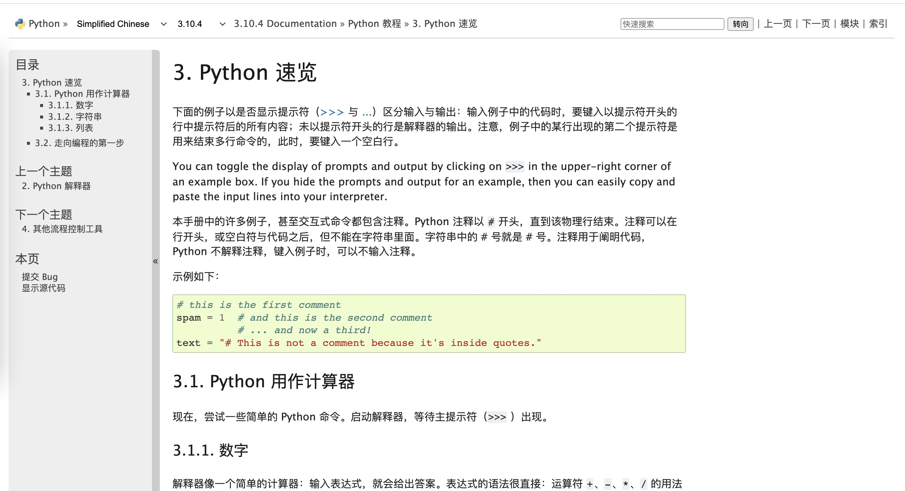
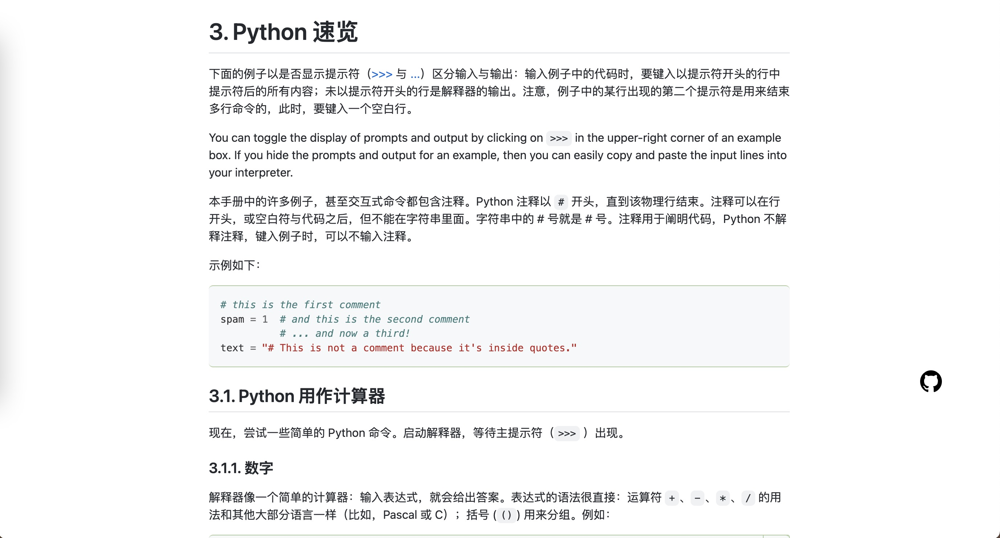

# beautiful-python-docs

## 背景

相信大家学习 Python 的时候一定有接触过 Python 的[官方文档](https://docs.python.org/)，文档比较全，并且支持多语言翻译，但美中不足的是文档的 UI 稍微有些跟不上时代，这可能会影响阅读体验。

现在，通过在 Chrome 中安装 `beautifu-python-docs` 插件，将会给你呈现一个更好看的 Python 文档！

## 效果

原先的 Python 文档：



beautiful-python-docs 美化后：



## 如何使用

因为资金问题暂时没有发布到 chrome extension store 的计划，如果你对 Node 足够熟悉，你可以通过执行以下操作获取一个扩展程序：

### 打包

```bash
yarn && yarn build
```

### 导入 Chrome

1. 在 Chrome 中打开扩展程序页面：chrome://extensions/，手动打开“开发者模式”，点击“加载已解压的扩展程序”，导入 beautiful-python-docs 目录下的 extension 文件夹；

2. 重新刷新 python 文档页面，最下方会出现一个绿色的 bar，点击即可查看 github-markdown-css 样式的文章！

如果你对 Node 并不熟悉，并且需要打包后的拓展程序，可以提个 issue 让我知道，或者发邮件给我，我会尽快将拓展程序推送到仓库！

## 后续

如果有一定使用量的话，后续也会支持其他的主题，或是功能！如果它有帮助到你，请 star，这是对我最大的肯定~

## 问题反馈

如果发现插件中存在的问题或是不足，可以提交你的问题到 github issue, 或提交一个 Pull Request, 感谢你的参与!
